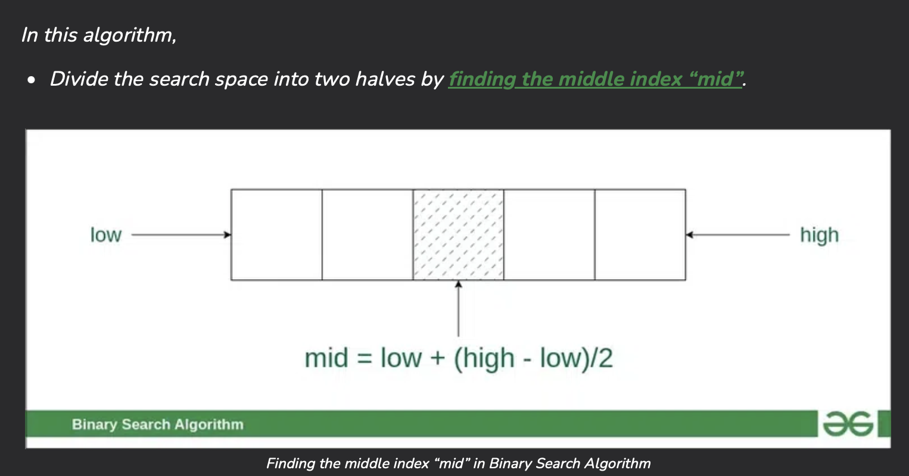
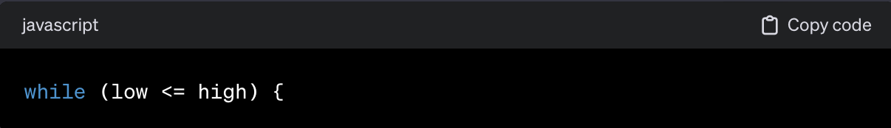

### What is Binary Search? --------------------------------------------------------------------------------------------------------

    * Binary search is an efficient algorithm for finding from a sorted list of items, it works on the divide and conquer apporach. The main idea is to keep track of the current range of reasonable guesses.

    * How does it do this? By repeatedly dividing in half the portion of the list that could contain the item, until we've narrowed down the possible locations to just one. In this case, if the item is not in the array, we should still return a value, since we're dealing with indexes of arrays, the most common is to return -1.

                                    STEPS IN A BINARY SEARCH ALGORITHM:

1 - We use the indexes to set a low value, a high value and a middle value wich will be the guess. 

    LOW = 0
    HIGH = Length of the array - 1
    MIDDLE = Math.floor((LOW + HIGH)/2) --->  If we come accross a float number, we round it down to get an integer with Math.floor

2 - The next step would be to iterate through the array until the element we are looking for is found or not. Since we are dealing with a sorted array, it would be better to approach it with a while loop instead of a for. A for loop would give us an advantage if we needed to iterate in sequential order, but the "guesses" that the algorithm takes are NOT in sequential order.

3 - Every time the algorithm takes a guess, if that index is not the element that we are looking for, the code will analyze if the element is less than or greater than the guess. By doing this, we will keep only the half that may contain it. The Low and High  are reassigned with a different value accordingly.

    ||       IF WE KEEP THE LEFT SIDE           ||            IF WE KEEP THE RIGHT SIDE         ||
    ||==========================================||==============================================||
    ||                                          ||                                              ||
    ||       * HIGH = Guess - 1                 ||                  * LOW = Guess + 1           ||
    ||                                          ||                                              ||
    ==============================================================================================

4 - These steps will continue iterating until we find the element or not returning either the index or -1 if not found.

### Edge Cases---------------------------------------------------------------------------------------------------------------------
    
    * Only works on sorted arrays!

### Time Complexity ---------------------------------------------------------------------------------------------------------------

    The binary search algorithm takes time to complete. In worst case scenario, time complexity is O(log n) - Log base 2. 

    * "n" = length of the array. Since everytime we iterate inside the loop, the array is divided in 2. We can confirm the following:

                            n  -->  n/2  -->  n/4  -->  n/8  -->  ...  -->  1

                            n  -->  n/2  -->  n/2^2  -->  n/2^3  -->  ...  -->  n/2^x  -->  1

                            n/2^x = 1  -->  n = 2^x  -->  2^x = n  -->  x = log2 (n)

    * So if we have an array with 1.000.000 elements, worst case scenario it'll take 20 iterations to find our target     

### Citations ---------------------------------------------------------------------------------------------------------------------

https://www.khanacademy.org/computing/computer-science/algorithms/binary-search/a/binary-search
https://chat.openai.com/share/ad522ffe-2509-43f6-a004-338d40649ef7

